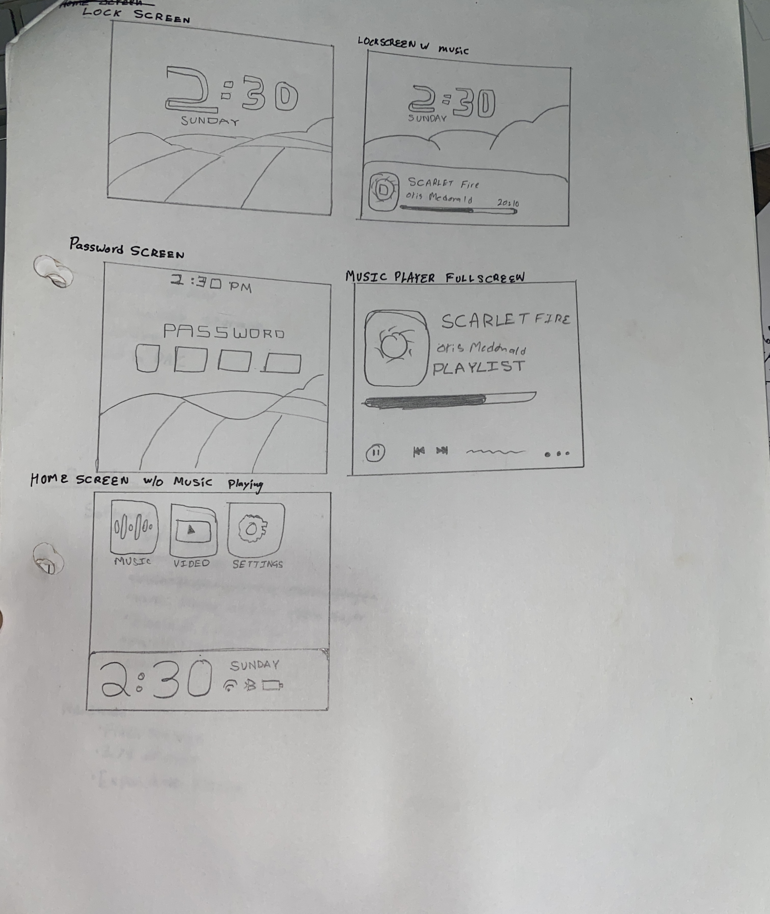

# March 21st

Planned out the requirements for Sonus including the hardware, software, and features to be implemented. Looked around instructables, reddit and other social platforms for inspiration on what people want and made a small document to document my research, also looked at iPod UI renders and added it also.

Mostly figured out that i might need to use a ESP32-S3 but i will probably prototype with an esp32 that i have readily at home. Also conversed with ChatGPT regarding the feasibility of the project, and confirmed that the ESP32 can indeed use Bluetooth and Wi-Fi at the same time on an esp32. I will also probably make an app to allow users to sync music onto the Sonus via bluetooth. I figured out the base plan on which i can start making my Music player on. heavily inspired from the iPod.

Also made up some rough drafts of the UI that i may want to implement in my music player, the document has all the things i was inspired to integrate into my music player.

https://docs.google.com/document/d/1kE1F0Hhei37jDiHUInFDBGJX95wxOnmSs1SGKVVP4iw/edit?usp=sharing

**TOTAL TIME SPENT : 4 HOURS**